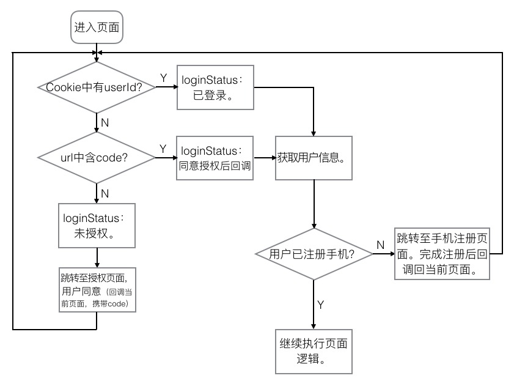
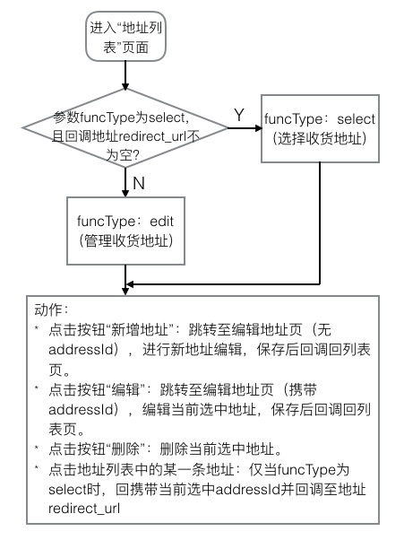

# 四季严选 项目总结
  
从入职到现在已经三个多月了，“四季严选”算是我接触的第二个项目，从需求分析到开发到上线，跟进了整体的流程。不论是在与整个团队的沟通协作，还是在自己开发的工作上我都尽自己的最大努力做到最好，也从中得到了锻炼。比如遇到问题，要以清晰的思路逐步去分析、解决问题。在工期较为紧张的情况下，要会抓住关键的问题，逐个击破。  

就前端而言，整个项目可以分为三个主要的业务：  

* 一般商品的购买流程  
* 活动商品的拼团购买流程
* “我的”用户相关内容管理

下面就对我负责的模块中较为主要的两部分做一个介绍。
## 授权登陆模块
如果用户在微信客户端中访问第三方网页，公众号可以通过微信网页授权机制，来获取用户基本信息，进而实现业务逻辑。
网页授权分为两种方式：  
1. 静默授权：  
	以snsapi_base为scope发起的网页授权，是用来获取进入页面的用户的openid的，并且是静默授权并自动跳转到回调页的。用户感知的就是直接进入了回调页（往往是业务页面）  
2. 需用户同意（ **我们选择的方式**）：  
	以snsapi_userinfo为scope发起的网页授权，是用来获取用户的基本信息的。但这种授权需要用户手动同意，并且由于用户同意过，所以无须关注，就可在授权后获取该用户的基本信息。  
具体的内容可以查阅 [微信|公众平台开发者文档](https://mp.weixin.qq.com/wiki/4/9ac2e7b1f1d22e9e57260f6553822520.html#.E7.AC.AC.E4.B8.89.E6.AD.A5.EF.BC.9A.E5.88.B7.E6.96.B0access_token.EF.BC.88.E5.A6.82.E6.9E.9C.E9.9C.80.E8.A6.81.EF.BC.89)

### 模块设计思路

### 待优化的问题
1. 跨平台的模块复用性没有进行处理，目前仅支持微信授权，跨平台后授权无法通过，也就无法进入页面进行正常展示了
2. 存在重复获取用户信息的情况，有信息冗余
3. 授权时没有用到微信开发者文档中提到的 refresh_token ，如果这部分需要优化，可能需要后台小哥的配合。

## 收货地址模块
地址的管理主要有两个入口：
1. 从“我的”页面中进入，目的是直接对收货地址进行管理
2. 从“订单确认页”进入，目的是选择（或者添加新的）收货地址

### 模块设计思路

### 待优化的问题
在从第二个入口（“订单确认页”）进入时，提示不够明确，用户不知道要通过点击存在于列表中的地址项来选择地址。
目前 UED 部门将重新给出优化的方案来提示用户选择地址，后期在一起请项目中会一并将问题修改掉。

## Code Review
本次项目中，农师父帮进行了一次 code review 发现了不少问题，我把这部分内容总结了一下。  
[点击此处查看](https://drizzlezxy.github.io/CodeReview/index.html)。

## 其他
在项目中，还遇到了其他许多问题，比如 git中如何忽略提交已被追踪的文件，点透问题，微信自带浏览器对scroll 事件的影响等，如何在浏览器中控制地址(history)的后退(回退)……。  
大部分已经在当时的周报中体现出，其中[如何在浏览器中控制地址(history)的后退(回退)](https://drizzlezxy.github.io/ProjectSum/browserBack.html)已经整理出相关文档。

## 总结
虽然项目稍有delay，但还是终于上线了，离不开大家的共同努力，很高兴我也能在其中出一分力。  
其次，我认为这次四季严选的开发时间稍显紧张，开发的小伙伴们后期的时候都很拼。  

对于我来说，可能很多模块在设计初期也没有做到考虑周全，复用性较低，逻辑也存在不够简洁清晰的情况，但是作为新人，参加这次四季严选的项目我还是收获了很多，应该要做到的及时总结，会对自己有更大的帮助，相信自己会逐渐成长起来的。