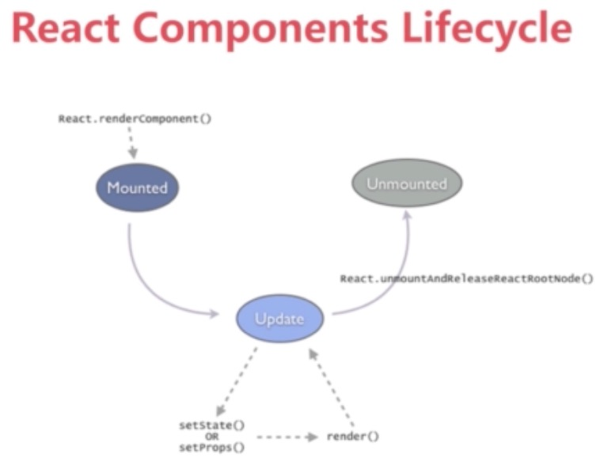
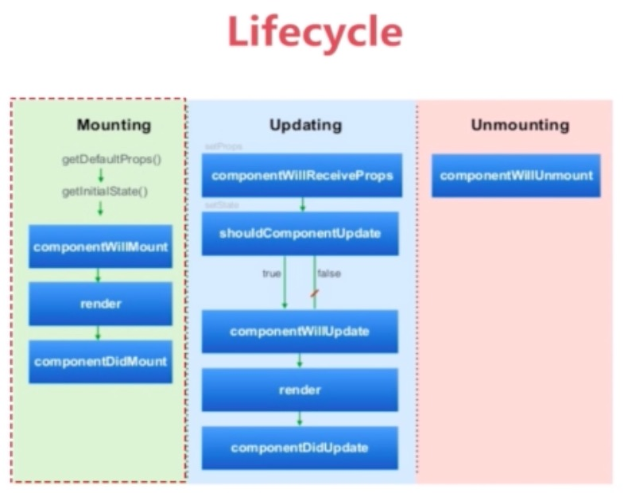
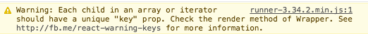

# 初识 React 生命周期 及 Diff 算法
  
首先，React 起源于 Facebook 的内部项目，是热门的前端框架之一。  
React 入门的门槛其实很低，推荐阅读 **阮一峰** 的 《React 入门实例教程》，之后就会对React框架有一个大体的概念。  
然后就可以根据自己的需要查阅[官方文档](https://facebook.github.io/react/docs/components-and-props.html)，获取各部分的内容。  


## 组件的状态和属性
可以这么说，一个 React 应用就是构建在 **React 组件(component)** 之上的。  

React 组件有两个核心概念：  

* state  
  组件的当前状态，可以把组件简单看成一个“状态机”，根据状态 state 呈现不同的 UI 展示。  
  也就是根据 state 的前后差异 (后面会提到的diff算法) 去刷新组建。  
  一旦状态 (state) 更改 (通过 `this.setState()` 方法来触发)，组件就会自动调用 render 重新渲染 UI.
* props  
  即为组件的属性，由调用当前组建的父层组建传入。  
  在组建内，我们只对其进行"读"操作 (`this.props.属性名`)，而不进行"写"操作。 
  除此之外，this.props.children 属性可以取到组件的所有子节点。比如：
  
  ```jsx
	let NotesList = React.createClass({
		render: () => {
			return (
				<ul>
					{
						this.props.children.map((child) => {
							return <li>{child}</li>
						})
					}
				</ul>
			)
		}
	});
	
	React.render(
		<NotesList>
			<span>hello</span>
			<span>world</span>
		</NotesList>,
		document.body
	);
  ```


## 组建生命周期的概念
  
**组建生命周期** 主要有以下三种情况：

* mount 
* update 
* unmount 

### mount 装载  
React component 被 render 解析生成对应的 DOM 节点，并被插入 HTML 页面的 DOM 结构的一个过程。  
当这个过程结束时，组件的状态就是 **mounted** 。  
### update 更新
指一个已经被mounted的组件被重新render的过程。  
当这个过程结束时，组件的状态是 **updated** 。  
而这个重新选染的过程，并不一定会引起相应 DOM 结构的改变。React 会对当前组件的 **当前 state** 与最近一次变更前的 state进行比较，只有当state确实发生改变，且确实影响到 DOM 结构时，相应的 DOM 结构才会被刷新。
### unmount 移除  
mount的逆过程，即一个已经被mounted的组件对应的 DOM 节点，被从 DOM 结构中一除的过程。

## 组建生命周期 及其对应的hook函数
React 对组件的每一个状态，都封装了相应的hook函数。在对特定的状态进行hook后，每个状态发生时，hook函数就能在第一时间对该状态作出相应。  
针对之前提到的 mount 、 update 、 unmount 三种情况，React都封装了将要 (will) 、已经(Did)两种状态。


### 1. mounting
* componentWillMount  
  组件开始 mounting 前被调用  
  
  ```jsx
	componentWillMount: () => {
	  // your bode here
	}
  ```
* componentDidMount()
  组件 mounted 之后被调用  
  
  ```jsx
	componentDidMount: () => {
	  // your bode here
	}
  ```
* 在这两者之间，组件会被 render 出来

### 2. updating
* componentWillUpdate  
  组件开始 updating 前被调用
  
* componentDidUpdate  
  组件 updated 之后被调用
  
* 在以上两者之间，组件会被重新 render  
  但是是什么因素使得React知道当前已加载的组件需要更新的呢，这时候就需要一下两组hook方法。
  
* componentWillReceiveProps  
  组件加载完成之后再 **每次** 收到 props 参数时，都会触发该hook函数。  
  它传入的参数就是本次新收到的 props 对象。可在函数内 根据新的 props 进行一些操作，比如修改 state 。  
  
  ```jsx
	componentWillReceiveProps: (newProps) => {
	  // your bode here
	}
  ```
  
* shouldComponentUpdate   
  在组建收到新的 props 或者变更 state 之后，shouldComponentUpdate方法会被调用。
  它的参数有两个： 新的 props 对象、 新的 state 对象。  
  可根据这两个参数去判断是否需要更新 DOM 结构。  
  
  ```jsx
	shouldComponentUpdate: (newProps) => {
	  // your bode here
	  return true; // or false
	}
  ```
  当该方法返回 true 时， DOM 结构会被更新。  
  当该方法返回 false 时， DOM 结构则不更新。  
  **若不重写该方法，则默认返回 true 。**
  
### 3. unmounting
* componentWillUnmount
  销毁组件前，该方法会被调用。  
  可在此处做一些数据清理工作。


## 虚拟 DOM 的 Diff 算法
在 Web 开发中，我们总需要将变化的数据实时反应到 UI 上，这时就需要对 DOM 进行操作。而复杂或频繁的 DOM 操作通常是性能瓶颈产生的原因。  

React 为此引入了虚拟 DOM（Virtual DOM）的机制：  
在浏览器端用 Javascript 实现了一套 DOM API。基于 React 进行开发时所有的 DOM 构造都是通过虚拟 DOM 进行，每当数据变化时，React 都会重新构建整个 DOM 树，然后 **React 将当前整个 DOM 树和上一次的 DOM 树进行对比，得到DOM结构的区别，然后仅仅将需要变化的部分进行实际的浏览器DOM更新** (这就是我们所说的 Diff 算法)。  

尽管每一次都需要构造完整的虚拟DOM树，但是因为虚拟 DOM 是内存数据，性能是极高的，而对实际DOM进行操作的仅仅是 Diff 部分，因而能达到提高性能的目的。同时，我们也不再需要关注某个数据的变化如何更新到一个或多个具体的 DOM 元素上，而只需要关心在任意一个数据状态下，整个界面是如何 Render 的。

### 概括
Diff 算法就是给定任意两棵树，找到最少的转换步骤。Facebook 工程师在React上将 Diff 算法复杂度直接降低到了 O(n)：
为了在树之间进行比较，我们首先要能够比较两个节点，在 React 中即比较两个虚拟 DOM 节点，当两个节点不同时，应该如何处理。这分为两种情况：

1. 节点类型不同
2. 节点类型相同，但是属性不同。  

接下来，我们先看第一种情况。

### 1. 不同节点类型的比较
当在树中的同一位置前后输出了 **不同类型的节点** ，React 直接删除前面的节点，然后创建并插入新的节点。  
DOM 元素时：

```html
render: <div></div> // Before
render: <span></span> // After

// 则算法会进行如下操作
[removeNode <div></div>],
[insertNode <span></span>]
```
组件时也同样：  

```html
render: <MyComponent /> // Before
render: <HisComponent /> // After

// 则算法会进行如下操作
[removeNode <MyComponent />],
[insertNode <HisComponent />]
```
删除节点意味着彻底销毁该节点，而不是再后续的比较中再去看是否有另外一个节点等同于该删除的节点。如果该删除的节点之下有子节点，那么这些子节点也会被完全删除，它们也不会用于后面的比较。这也是算法复杂能够降低到 O(n)的原因。  

#### 1.1 列表节点的比较
由上面的内容可知，当同一层级的列表元素中，增加或删减了其中一部分节点，那么之后的节点虽然完全没有变化，但也会被全部删除，造成极大的浪费。而这，就涉及到列表节点的Diff算法。  
相信很多使用React的同学大多遇到过这样的警告：
  
React 要求，给列表中每个节点唯一的标识 (key) ，那么 React 就能够定位到原先相对应的节点从而进行比较，而不会“傻瓜式”地直接将同一位置删除，大幅减少DOM操作次数，提高了性能。

#### 1.2 逐层进行节点比较
React对不同类型的节点的处理逻辑我们很容易得到推论，那就是React的DOM Diff算法实际上只会对树进行逐层比较。  
  
如上图，React 只会对相同颜色方框内的 DOM 节点进行比较，即同一个父节点下的所有子节点。当发现节点已经不存在，则该节点及其子节点会被完全删除掉，不会用于进一步的比较。这样只需要对树进行一次遍历，便能完成整个 DOM 树的比较。

### 2. 相同类型节点的比较
**相同类型节点的比较** 就比较容易理解，仅仅是对属性进行重设从而实现节点的转换：

```html
render: <div id="before" /> //Before
render: <div id="after" /> //After

// 则算法会进行如下操
[replaceAttribute id "after"]
```
虚拟DOM的style属性稍有不同，其值并不是一个简单字符串而必须为一个对象:

```html
render: <div style={{color: 'red'}} /> //Before
render: <div style={{fontWeight: 'bold'}} /> //After

// 则算法会进行如下操
[removeStyle color]
[addStyle font-weight 'bold']
```

## 最后
关于“由 DOM Diff 算法理解组件的生命周期”部分的内容，推荐大家仔细阅读[《虚拟DOM Diff算法解析》](http://www.infoq.com/cn/articles/react-dom-diff), 这篇文章的作者有一个非常有意思的 Demo 可以帮助大家理解 React 的 Diff 算法，以及它基于生命周期的组件更新机制。


