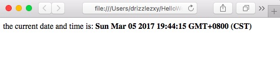
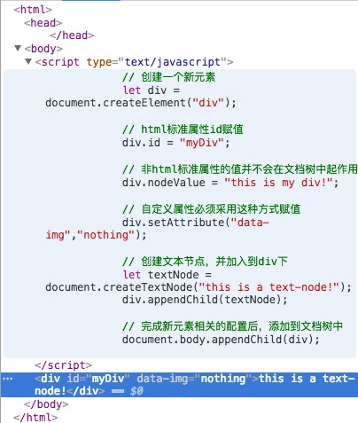

# DOM
## 节点的概念
### 1. 节点的类型
在javaScript中，所有DOM元素都是由以下12个Node类型实现的。
（除了IE，其他的浏览器都可以直接访问到这些类型。）

```js
Node.ELEMENT_NODE 			// 1
Node.ATTRIBUTE_NODE			// 2
Node.TEXT_NODE				// 3
Node.CDATA_SECTION_NODE		// 4
Node.ENTITY_REFERENCE_NODE	// 5
Node.ENTITY_NODE			// 6
Node.PROCESSING_INSTRUCTION_NODE	// 7
Node.COMMENT_NODE			// 8
Node.DOCUMENT_NODE			// 9
Node.DOCUMENT_TYPE_NODE		// 10
Node.DOCUMENT_FRAGMENT_NODE	// 11
Node.NOTATION_NODE			// 12
```
### 2. 节点的关系


### 3. 操作节点
#### a. 将新的节点添加到DOM中
- `parentNode.appendChild(newNode)`  
	在父节点[parentNode]的childNodes列表末尾添加一个节点[newNode]
- `parentNode.insertBefore(newNode, childNode)`  
	在父节点[parentNode]的指定子节点[childNode]前插入一个节点[newNode]  
	若第二个参数为null，则插入在末尾，效果同appendChild()
- `parentNode.replaceChild(newNode, childNode)`
	用子节点[newNode]取代原有的子节点[otherNode]

以上三个方法：
均会返回插入的newNode以供操作。

```js
var returnedNode = parentNode.appendChild(newNode);
```
若[newNode]是DOM中的现有节点，则该节点不会在DOM中出现两次。该节点移动到新的指定位置后，原位置的节点会被删除。

#### b. 移除节点
-  `parentNode.removeChild(childNode)`

#### c. 复制节点
- `someNode.cloneNode([boolean])`
	复制现有的节点，传入的boolean表是否深克隆（深克隆会将该节点以及其子节点一同复制，浅克隆则只复制该节点本身）。
	复制后还需要通过`appendChild()`或`insertBefore()`或`replaceChild()`使其占据DOM中的具体位置

## Document类型节点
我们平时js中所用的document对象，就是12种节点中的DOCUMENT_NODE的一个实例，表示整个HTML页面。 

- 子节点  
	+ `<html>`元素  
		document.documentElement  
	+ `<body>`元素  
		document.body  
	+ `<title>`元素  
		document.title

- 文档信息
	其实就是该文档的HTTP请求中的一些信息，只不过可以通过js访问。
	+ URL地址
		`document.URL` 完整URL
	+ domain
		`document.domain` 主机域名
	+ referrer
		`document.referrer` 来源页面的URL
- 查找元素
	+ `document.getElementById('myDiv')`  
	+ `document.getElementsByTagName('div')`  
		其中，括号中的tagName不区分大小写  
	+ `document.getElementsByClassName('m-header')`  
		HTML5中新增方法

	后两种方法，都会返回一个包含所有符合条件的节点的“动态”集合--HTMLCollection对象，该对象类似于一个存放了零个或多个节点的数组。  
	当然还有一下一些特殊的节点可以直接取到，可以方便我们操作。
	
	```js
	// 所有带name特性的<a>元素
	document.anchors
	
	// 所有的<form>元素
	document.forms
	
	// 所有的元素
	document.images
	
	//所有带href特性的<a>元素
	document.links
	```
- 文档写入
	在页面加载时，`document.write()`可以在当前script标签所在的位置写入对应的内容。
	
	```html
	<html>
		<head>
		</head>
		<body>
			<p>the current date and time is:
			<script type="text/javascript">
				document.write("<strong>" + (new Date()).toString() + "</strong>")
			</script>
			</p>
		</body>
	</html>
	```
	页面效果如下：
	
	
	但如果在文档加载结束后再调用document.write方法，则输出的内容会重写整个页面。
	
	```html
	<html>
		<head>
		</head>
		<body>
			<p>the current date and time is:
			<script type="text/javascript">
				window.onload = () => {
					document.write("<strong>" + (new Date()).toString() + "</strong>")
				}
			</script>
			</p>
		</body>
	</html>
	```
	页面效果如下：
		
	
## Element类型节点
12种节点中的ELEMENT_NODE的实例，就是HTML中的元素。 

```js
let div = document.getElementById('myDiv');

// 以下两个属性均可读取元素标签名
div.tagName;		// "DIV"
div.nodeName;		// "DIV"
```
+ 节点特性
	- 读取节点特性
		
		```js
		div.getAttribute("id");		// "myDiv"
		```
	- 设置节点特性
	
		```js
		div.setAttribute("id", "yourDiv");		// "myDiv"
		```
	- HTML特性
		前两种方法，无论是标准的HTML特性还是自定义特性，都可以进行操作。  
		但对于标准的HTML特性，其实它也会被存储在元素节点对应的属性中，但自定义特性并不会。 
		
		```js
		div.id;	// "yourDiv"
		```
+ 创建元素

	按一下步骤创建新的元素：
	
	```html
	<html>
		<head>
		</head>
		<body>
			<script type="text/javascript">
				// 创建一个新元素
				let div = document.createElement("div");
				
				// html标准属性id赋值
				div.id = "myDiv";
				
				// 非html标准属性的值并不会在文档树中起作用
				div.nodeValue = "this is my div!";
				
				// 自定义属性必须采用这种方式赋值
				div.setAttribute("data-img","nothing");
				
				// 创建文本节点，并加入到div下
				let textNode = document.createTextNode("this is a text-node!");
				div.appendChild(textNode);
	
				// 完成新元素相关的配置后，添加到文档树中
				document.body.appendChild(div);
			</script>
		</body>
	</html>
	```
	则文档树中会被插入新元素：  
	
	
	
## DocumentFragment类型节点
DocumentFragment类型节点在文档树中并没有对应的标记，它的nodeType值是11。  
我们往往把它当作一个“仓库”来使用。因为频繁的DOM操作是十分麻烦且影响性能的，这个时候我们就会将一个需要有大量操作的文档片段存在“仓库”里，最后操作完成后再插入文档树。

```js
let fragment = document.createDocumentFragment();
			
divs.map((item, index) => {
	// 将节点添加至文档片段下
	fragment.appendChild(item);
}

// 最后将文档片段添加到文档树中
document.body.appendChild(fragment);
```
此时，文档片段里所有的子节点被删除，并转移到了文档树中。
