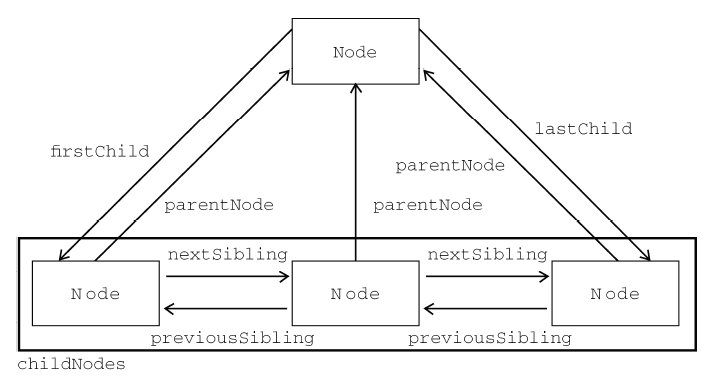

# DOM
## 节点的概念
### 1. 节点的类型
```js
Node.ELEMENT_NODE 			// 1
Node.ATTRIBUTE_NODE			// 2
Node.TEXT_NODE				// 3
Node.CDATA_SECTION_NODE		// 4
Node.ENTITY_REFERENCE_NODE	// 5
Node.ENTITY_NODE			// 6
Node.PROCESSING_INSTRUCTION_NODE	// 7
Node.COMMENT_NODE			// 8
Node.DOCUMENT_NODE			// 9
Node.DOCUMENT_TYPE_NODE		// 10
Node.DOCUMENT_FRAGMENT_NODE	// 11
Node.NOTATION_NODE			// 12
```
### 2. 节点的关系


### 3. 操作节点
#### a. 将新的节点添加到DOM中
- parentNode.appendChild(newNode)
	在父节点[parentNode]的childNodes列表末尾添加一个节点[newNode]
- parentNode.inserBefore(newNode, childNode)
	在父节点[parentNode]的指定子节点[childNode]前插入一个节点[newNode]  
	若第二个参数为null，则插入在末尾，效果同appendChild()
- parentNode.replaceChild(newNode, childNode)
	用子节点[newNode]取代原有的子节点[otherNode]

以上三个方法：
均会返回插入的newNode以供操作。

```js
var returnedNode = parentNode.appendChild(newNode);
```
若[newNode]是DOM中的现有节点，则该节点不会在DOM中出现两次。该节点移动到新的指定位置后，原位置的节点会被删除。

#### b. 移除节点
-  parentNode.removeChild(childNode)

#### c. 复制节点
- someNode.cloneNode([boolean])
	复制现有的节点，传入的boolean表是否深克隆（深克隆会将该节点以及其子节点一同复制，浅克隆则只复制该节点本身）。
	复制后还需要通过`appendChild()`或`insertBefore()`或`replaceChild()`使其占据DOM中的具体位置

## Document类型节点
我们平时js中所用的ducument对象，就是12种节点中的DOCUMENT_NODE的一个实例，表示整个HTML页面。
- 子节点
	+ `<html>`元素
		document.documentElement
	+ `<body>`元素
		document.body
	+ `<title>`元素  
		document.title
- 文档信息
	其实就是该文档的HTTP请求中的一些信息，只不过可以通过js访问。
	+ URL地址
		`document.URL` 完整URL
	+ domain
		`document.domain` 主机域名
	+ referrer
		`document.referrer` 来源页面的URL
- 