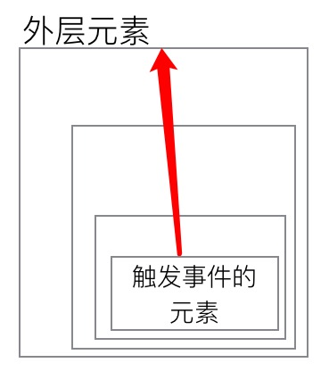
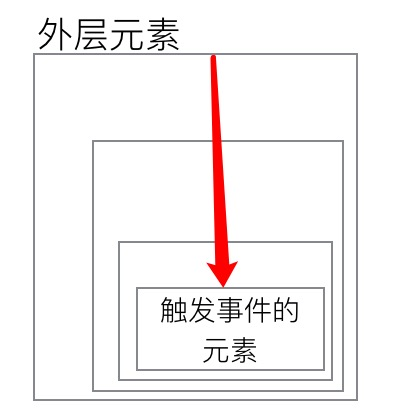
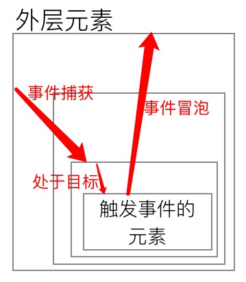

## 事件基本概念
事件是JavaScript与HTML交互的桥梁。  
当文档或浏览器窗口中发生一些特定的动作（如click，load，mouseover）的瞬间，我们使用监听器来预定一些事件，一边事件发生时执行相应的代码。
### 事件流
**事件流**描述的是页面接收事件的顺序。  
最早，IE提出的事件流是**事件冒泡流**，而Netscape Communicator提出了**事件捕获流**。

- 事件冒泡  
	事件冒泡是指事件由最开始发生事件的具体元素开始，一层一层向上逐级传递。  
	
- 事件捕获  
	事件捕获是最早接收事件的节点是最外层的对象，然后逐级向下，直到传递至具体发生事件的元素。  
	
- DOM事件流  
	在“DOM2级事件”中，将事件流整合成为三个阶段：  
	+ 事件捕获阶段  
		事件传递至目标元素的父级元素
	+ 处于目标阶段  
		事件在目标元素上发生（但在这一阶段在事件处理中被看成是事件冒泡阶段的一部分）
	+ 事件冒泡阶段  
		事件逐级向上传递至最外层。  
	
	*IE9+，及各大主流浏览器都支持该事件流。*

	


### 事件处理程序
当我们监听到事件发生后，所调用执行的程序，就是事件处理程序。
我们有三种方式为事件指定处理程序。  

- HTML事件处理程序  
	在HTML对应元素上的“on[事件]“特性的值内填上可执行的全局作用域下的JavaScript代码。

	```html
	// 弹出警告框，提示”Clicked！“
	<input id="myInput" onclick="alert('Clicked!')" />
	
	// 当然执行函数的代码也是”可执行的全局作用域下的JavaScript代码“，
	// 所以以下方式调用较笨重的函数也可执行，但要确保事件触发时，脚本已经加载完毕
	<input onclick="showMSG()" />
	<script>
		function showMSG() {
			alert('Clicked!');
		}
	</script>
	```
- DOM0级事件处理程序  
 每个元素都有自己的事件处理程序属性，给这个属性设置一个值（函数），就可指定事件处理程序。
 当给这个值赋值为null时，相当于酒删除了该事件的处理。  
 
	```js
	let myInput = document.getElementById("myInput");
	myInput.onclick = (ev) => {
		alert('Clicked!');
	}
	
	// 删除事件处理
	myInput.onclick = null;
	```
- DOM2级事件处理程序  
	”DOM2级事件“定义了两个方法：  
	+ `element.addEventListener('[事件]', (ev) => { /*your code here*/ }, [boolean])`  
		绑定事件。
	+ `element.removeEventListener('[事件]', (ev) => { /*your code here*/ }, [boolean])`  
		删除相应事件。

	这两个API都接受三个参数：第一个是事件名，第二个是时间处理函数，第三个是一个布尔值（true代表在事件捕获阶段执行事件处理函数，false表示在冒泡阶段）。  
	
	```js
	myInput.addEventListener('click', showMSG, false);
	myInput.removeEventListener('click', showMSG, false);
	```
	与前两种指定处理程序方式不同的是，用element.addEventListener方法可以给同一个元素的同一个事件指定多个事件处理程序，根据指定顺序逐个执行。  
	需要注意的是，若element.addEventListener中指定了一个匿名函数作为程序处理函数，则无法通过element.removeEventListener将其删除。
	
### 事件对象
在触发DOM上的某个事件时，会产生一个包含着一些事件信息的event对象，以便在事件处理函数中调用。
对于以上三种形式的事件处理程序，

- HTML事件处理程序的事件对象就是代码片段中的event变量  

	```html
	// 弹出警告框，提示”Clicked！“
	<input id="myInput" onclick="alert(event.type)" />
	```
	
- 后两种DOM事件处理程序的事件对象，作为参数传入事件处理程序  
	
	```js
	// DOM0级
	myInput.onclick = (ev) => {
		alert(ev.type);
	}
	
	// DOM2级
	myInput.addEventListener('click', showMSG, false);
	function showMSG(ev) {
		alert(ev.type);
	}
	```
	
事件对象一般会有以下这些成员：  
FIXME


## 事件类型
以上是关于事件如何发生，以及如何处理的一些过程，*事件类型*就介绍了DOM3规定了会在Web浏览器中发生那些特定的事件。  
- UI事件
- 焦点事件
- 鼠标与滚轮事件
- 键盘与文本事件
- 复合事件
- 变动事件
- HTML5事件
- 设备事件
- 触摸与收拾事件


## 事件委托
在JavaScript中，事件处理程序的数量直接关系到页面的整体运行性能(内存、频繁的DOM访问等原因造成)。  
那么一方面，我们可以及时的删除无用的事件处理程序，另一方面，就是通过事件委托的方式，减轻负担。  
事件委托利用了事件冒泡的原理。  
当一个父元素有多个后代元素需要镇对同一个事件（比如click）绑定相同或者不同的事件处理程序时，由于事件的冒泡机制，该父元素最终都会接收到这些后代元素的事件。 而事件对象的target成员又可以帮我们判断事件发生的目标元素是谁，那么我们就可以将事件处理函数统一委托给该父元素，再在事件处理程序内部去辨别相应的处理。  
假设有以下HTML代码。

```html
<ul id="myLinks">
	<li id="goSomewhere">Go somewhere</li>
	<li id="doSomething">Do something</li>
	<li id="sayHi">Say Hi</li>
</ul>
```
则我们把各个子元素的事件都委托给ul元素
```js
	FIXME
```