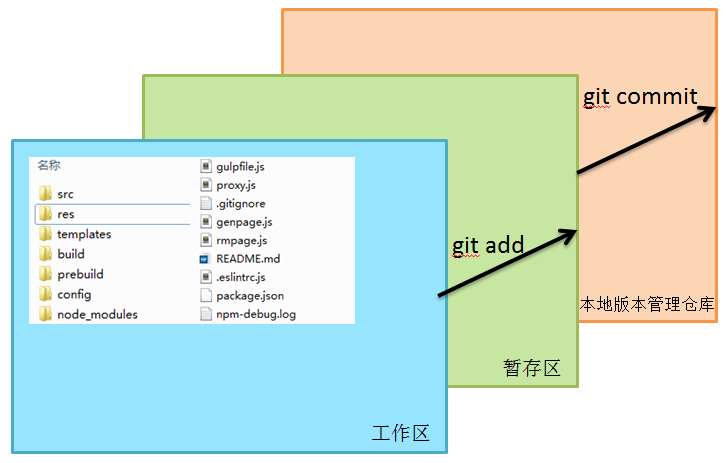
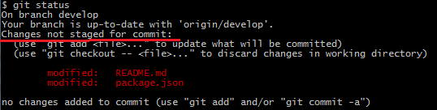
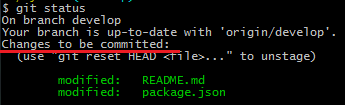
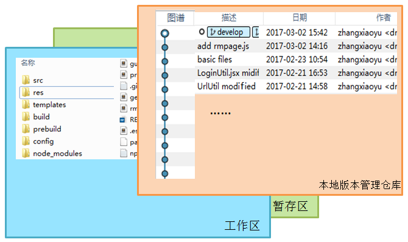
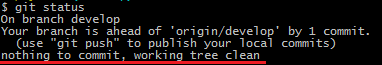
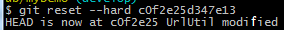
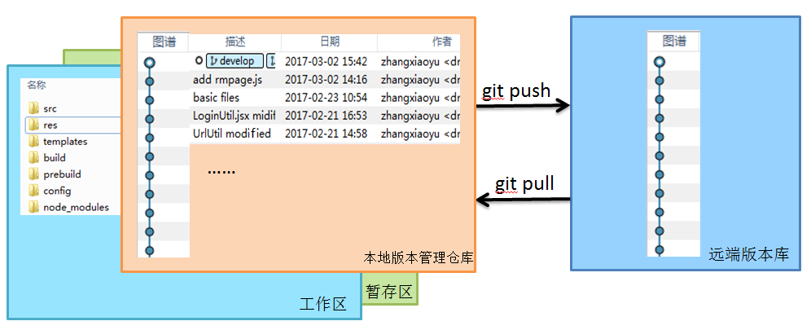
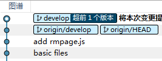
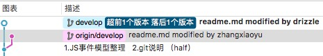

## 本地仓库&远端仓库

### 1. 建立本地仓库
- 新建本地仓库
	
	```
	git init	
	```
	此时当前文件夹就是一个新的仓库。  
	该目录下会多出一个.git文件夹，里面的文件是用来跟踪管理版本库的，一般情况下不建议手动修改。  

- 从远端仓库检出
	
	```
	git clone [远端仓库地址]
	```
	该命令执行成功后，远端仓库会被检出到本地。

### 2. 本地仓库  

- 工作区  
	可见文件的区域，我们对文件的操作都是针对工作区的。  

	当对工作区的文件进行变更，这时候，这些变更没有被提交（暂存区或版本库），用`git status`命令可以看到以下状态，工作区是脏的。  
	  

- 暂存区
	顾名思义，将变更提交的暂存区，提交到版本库的过渡。

	```
	git add [file]
	```
	`add`命令可以将工作区的变更添加到暂存区。（`git add .`可以将所有变更添加到暂存区）
	此时再用`git status`命令可以看到以下状态。  
	  

- 版本库
	对已经提交的变更进行版本管理。  
	   
	每个版本节点中存有当前提交的一些文件信息，如果文件后续变更后，还需要之前的文件信息，则可以从版本库中检出之前的文件信息。  
	`commit`命令可以将暂存区的变更保存至版本库，形成一个新的版本节点。

	```
	git commit -m '[变更的描述]'
	```
	同样的，用`git status`查看状态，工作区是干净的，没有需要提交的内容。
	
 
- HEAD
	到这里我们可以看到，版本库里面有许多的版本节点，那么我们的工作区到底显示的是哪个版本的文件，是在对哪个版本下的文件进行变更呢？  
	HEAD就起到这样一个作用，类似于当前活跃版本节点的指针：HEAD指向的位置，就是我们当前工作区所在的版本节点，包括后面会提到的分支切换，其实也是HEAD指针指向的版本节点的切换。  
	比如，我们用reset指令将工作区的内容切换到之前的版本（描述为'UrlUtil modified'）：  
	
	可以看到提示**HEAD is now at c0f2e25 UrlUtil modified**。

### 3. 远端仓库
远端仓库是这样的一个角色，所有人都可以从远端仓库托管的文件克隆一份到自己的电脑上，并且各自把各自的提交推送到远端仓库里，也从远端仓库中拉取别人的提交。


对远端仓库我们有两个基本的操作，这两个操作都是在本地版本库和远端版本库间的操作。

- 推送本地版本至远端
	
	可见上图中，本地版本库有一个新的提交版本没有推送到远端，这时候远端没有我们本地最新版本的信息，需要执行以下命令将本地的最新版本信息推送到远端。

	```
	git push
	```
	执行之后，就把本地的最新版本推送到远端了。

- 将远端版本拉到本地仓库
	类似的，如果别人对把他们的变更提交到远端，这时候我们本地版本库就比远端落后几个版本，我们可以通过`pull`命令将远端的版本拉到本地。

	```
	git pull
	```

#### 文件冲突
如果我们想要把本地的变更push到远端的时候，远端版本库被别人提交过了，这时候就会出现提交失败的情况，就像下图的情况。  
  
这时候我们需要两步：  

1. 将远端最新的版本拉到本地

	```
	git pull
	```
	这时候，如果远端的变更跟本地变更没有冲突，则会快速合并，即可以跳过下一步，直接进行第3步。  
	若有冲突，
2. 合并远端仓库和本地的变更
	首先需要手动解决冲突的文件，然后再提交解决了冲突的文件。

	```
	git add .
	git commit -m '[几条合并后的代码]'
	```
3. 提交本地变更

	```
	git push
	```